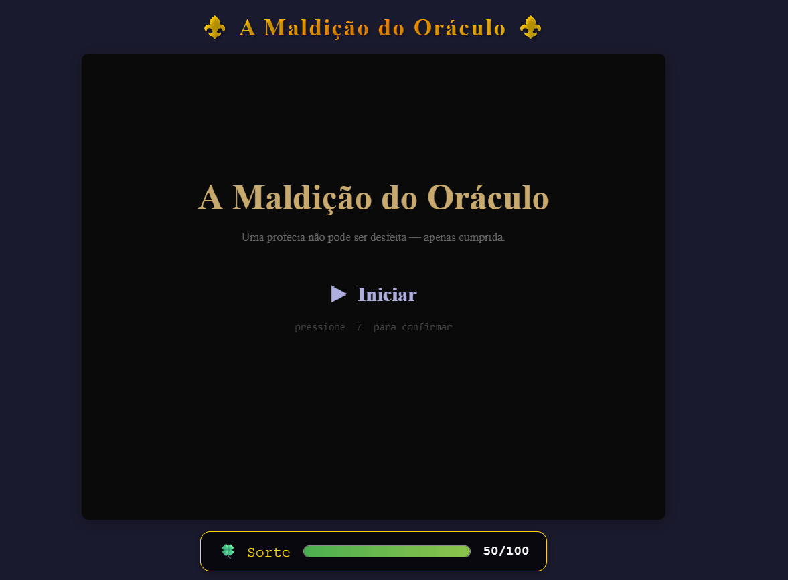
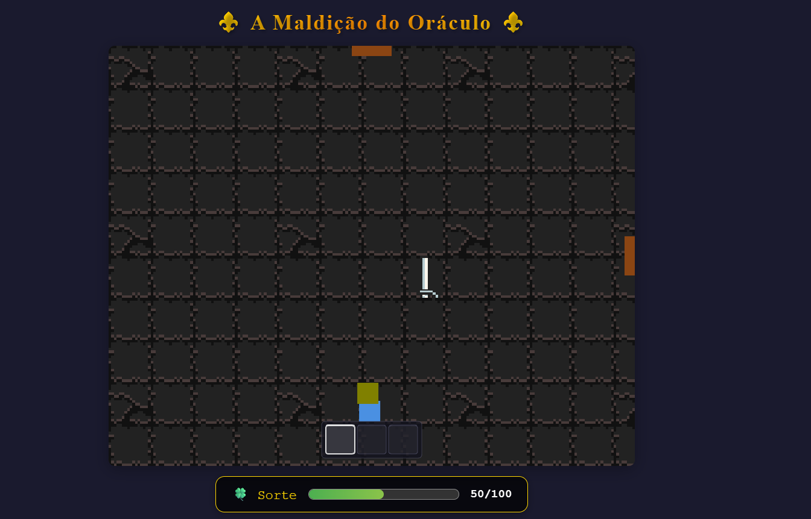
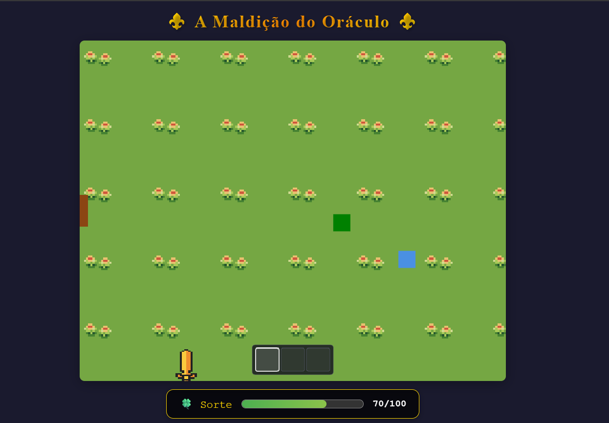

# Oráculo da Maldição

**Número da Lista:** 61  
**Conteúdo da Disciplina:** Dividir e Conquistar

## Alunos

| Matrícula  | Aluno                |
| ---------- | -------------------- |
| 231026311  | Eduardo Valadares    |
| 231027195  | Caio Venâncio        |

## Vídeo de apresentação

[Apresenção de Oráculo da Maldição](https://youtu.be/HlAjuzPzlI8)

## Sobre

**Oráculo da Maldição** é um dungeon crawler roguelike desenvolvido em JavaScript, inspirado em jogos como The Binding of Isaac, Hades e Dead Cells. O jogador explora calabouços cheios de inimigos, coleta itens de sorte e melhor combate para vencer os desafios.

### Mecânicas Principais

- **Exploração:** Navegue por salas interconectadas em um mapa dinâmico
- **Combate:** Enfrente inimigos (meteoros) e chefes usando armas e itens especiais
- **Loot:** Colete armas, poções, arcos, dados da sorte e itens místicos (tele-sena, bingo, pé de coelho, etc.)
- **Progressão:** Melhore seu inventário e capacidades para ficar mais forte
- **Roguelike:** Morra e recomece com desafios variados a cada run

### Arquitetura

O projeto utiliza **Entity Component System (ECS)** para gerenciar entidades (jogador, inimigos, itens) e seus sistemas (movimento, colisão, combate, renderização).

## Screenshots

### 1. Tela de Menu
Menu inicial do jogo mostrando o título "A Maldição do Oráculo", uma descrição temática e o botão "Iniciar". Exibe também a barra de Sorte do jogador.



### 2. Calabouço Escuro
O jogador explorador um calabouço escuro enfrentando inimigos. É possível ver o jogador (personagem branco), inimigos, itens no chão (amarelo e azul) e o inventário na parte inferior.



### 3. Sala Verde com Múltiplos Inimigos
Uma sala diferente repleta de inimigos. O jogador está equipado com uma arma (espada amarela) e o inventário mostra os itens coletados durante a exploração.



## Instalação

**Linguagem:** JavaScript  
**Framework:** Nenhum (Vanilla JS com arquitetura ECS)

1. Clone o repositório:
```bash
git clone <repositorio>
cd G61_Dividir-e-Conquistar_PA-26.1
```

2. Abra no navegador:
```bash
# Use um servidor local (recomendado)
python3 -m http.server 8000
# Acesse: http://localhost:8000
```

Ou simplesmente abra o arquivo `index.html` no navegador.

## Uso

1. **Iniciar o jogo:** Abra `index.html` no navegador
2. **Movimentação:** Use as setas do teclado ou WASD
3. **Combate:** Aproxime-se dos inimigos para atacar
4. **Inventário:** Colete itens para ganhar vantagens
5. **Objetivo:** Explore as salas, derrote inimigos e tente sobreviver ao máximo

## Estrutura do Projeto

```
├── game.js              # Motor principal (ECS World)
├── main.js              # Inicialização do jogo
├── index.html           # Página principal
├── styles.css           # Estilos do jogo
├── components/          # Entidades e componentes ECS
├── systems/             # Sistemas de gameplay (movimento, colisão, combate, etc)
├── resources/           # Assets (armas, sprites, etc)
└── utils/               # Funções utilitárias
```

## Status do Projeto

Atualmente em desenvolvimento com as seguintes features:
- ✅ Sistema de movimento
- ✅ Sistema de colisão
- ✅ Sistema de renderização
- 🔄 Sistema de combate (em desenvolvimento)
- 🔄 Sistema de inventário
- 🔄 Sistema de spawn de itens
- 📋 Boss fight
- 📋 Efeitos visuais avançados
